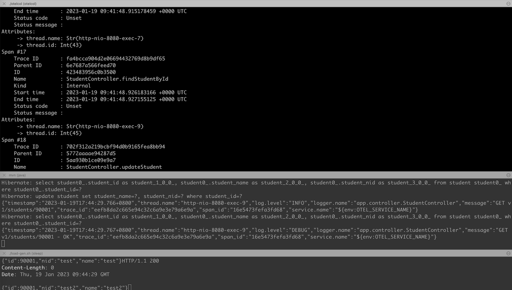

# OpenTelemetry Experiments

## The Changes Needed to Make?

Instrumentation may introduce impact / code changes for applications, in two levels: the code and the run time. Will the Java auto-instrumentation help mitigate / reduce the impact?

### The Code

For **metrics** and **traces**, simply adding the `-javaagent:<path-to>/opentelemetry-javaagent.jar` will just work.

For **logs**, where the support is still in early days, there is a way to auto instrument some popular logging frameworks, like [Log4j2](https://github.com/open-telemetry/opentelemetry-java-instrumentation/blob/86961d496ade8a1876e9548af9c391a0645ce649/instrumentation/log4j/log4j-2.13.2/library/README.md) and [Logback](https://github.com/open-telemetry/opentelemetry-java-instrumentation/tree/86961d496ade8a1876e9548af9c391a0645ce649/instrumentation/logback/logback-1.0.0/library), among others. The idea is to instrument the log entities by injecting the **trace ID** and **span ID** from a mounted span into logging framework’s context data, for example, Log4j2’s [Mapped Diagnostic Context](https://logging.apache.org/log4j/2.x/manual/thread-context.html) (MDC).

In this case, Log4j2 will automatically instrument the log entities with the keys added to the context when a span is active.
* traceId
* spanId
* sampled

For **logs** to work, we need to add required dependencies to auto-instrument above mentioned logging frameworks. 

As I use Log4j2, what I've added are:

```xml
    <dependency>
      <groupId>io.opentelemetry.instrumentation</groupId>
      <artifactId>opentelemetry-log4j-2.13.2</artifactId>
      <version>1.9.2-alpha</version>
      <scope>runtime</scope>
    </dependency>
```

### The Run Time

Before we dive into what changes we need to make during the run time, we need to know the conventions the Java auto-instrumentation framework has, especially the [environment variables](https://opentelemetry.io/docs/reference/specification/sdk-environment-variables/), including the [General SDK Configuration](https://opentelemetry.io/docs/concepts/sdk-configuration/general-sdk-configuration/) and [OTLP Exporter Configuration](https://opentelemetry.io/docs/concepts/sdk-configuration/otlp-exporter-configuration/). We can influence the behaviours by setting the right variables with the right values.

When running in non-Kubernetes environment, the minimum environment variable(s) might be:
* OTEL_EXPORTER_OTLP_ENDPOINT

In this case, we can simply start like this – assuming the Receiver is listening at port 55690 in local machine, like what OpenTelemetry Collector does:

```sh
export OTEL_EXPORTER_OTLP_ENDPOINT=http://localhost:55690
export OTEL_SERVICE_NAME=springboot-app # one extra var we use here as we will make it as part of our log entry attr

mvn spring-boot:run \
  -Dspring-boot.run.profiles=otel,h2 \
  -Dspring-boot.run.jvmArguments="-javaagent:`pwd`/opentelemetry-javaagent.jar"
```

When running in Kubernetes (and its commercial distributions like OpenShift) environment, there are some conventions:
* The opentelemetry-javaagent.jar will be mounted to: /otel-auto-instrumentation/javaagent.jar
* The javaagent environment variable will be exposed through JAVA_TOOL_OPTIONS
* There are a few OTEL_* system variables exposed, for example:
  * `JAVA_TOOL_OPTIONS`=-javaagent:/otel-auto-instrumentation/javaagent.jar
  * `OTEL_EXPORTER_OTLP_ENDPOINT`=http://instana-agent.instana-agent.svc:4317
  * `OTEL_RESOURCE_ATTRIBUTES`=k8s.container.name=springboot-swagger-jpa-stack,k8s.deployment.name=springboot-swagger-jpa-stack,k8s.namespace.name=demo,k8s.node.name=10.163.36.75,k8s.pod.name=springboot-swagger-jpa-stack-6f664c46f8-247gk,k8s.replicaset.name=springboot-swagger-jpa-stack-6f664c46f8
  * `OTEL_RESOURCE_ATTRIBUTES_NODE_NAME`=10.163.36.75
  * `OTEL_RESOURCE_ATTRIBUTES_POD_NAME`=springboot-swagger-jpa-stack-6f664c46f8-247gk
  * `OTEL_SERVICE_NAME`=springboot-swagger-jpa-stack

In this case, we need to make sure, while building Docker images, that the `JAVA_TOOL_OPTIONS` is injected so that such settings can be automatically picked up, without a need for further changes.

For example, this is the way in my Dockerfile, [here](https://github.com/brightzheng100/springboot-swagger-jpa-stack/blob/master/Dockerfile#L78-L85):

```dockerfile
# Prepare and set the entry point
RUN echo '#!/bin/sh' > start.sh \
    && echo "exec java \${JVM_ARGS} \${JAVA_TOOL_OPTIONS} -cp /app:/app/lib/* -Djava.security.egd=file:/dev/./urandom \\" >> start.sh \
    && cat /app/META-INF/MANIFEST.MF | grep 'Start-Class: ' | cut -d' ' -f2 | tr -d '\r\n' >> start.sh \
    && echo "" >> start.sh \
    && cat start.sh \
    && chmod +x start.sh
ENTRYPOINT [ "/app/start.sh" ]
```

## The Deployment Patterns

There might be quite some patterns if we want to run it end-to-end. For example:

* Instrumented apps --> some backend
* Instrumented apps --> some agent --> some backend
* Instrumented apps --> some agent --> some proxy --> some backend

For the simplicity, let's run [OpenTelemetry Collector Contrib](https://github.com/open-telemetry/opentelemetry-collector-contrib) as the "backend" `OTEL_EXPORTER_OTLP_ENDPOINT` and dump whatever have received, to simplify the demo, as using a complex backend might take more efforts.

Why not [OpenTelemetry Collector](https://github.com/open-telemetry/opentelemetry-collector), aka `otelcol`, but [OpenTelemetry Collector Contrib](https://github.com/open-telemetry/opentelemetry-collector-contrib)? Well, as the demo in below `otel-collector.yaml` uses "contrib" components, for example, the `tcplog`.

```yaml
receivers:
  otlp/2:
    protocols:
      grpc:
        endpoint: 0.0.0.0:55690
      http:
  tcplog:
    listen_address: 0.0.0.0:54525

processors:
  batch:

exporters:
  logging:
    verbosity: normal # detailed|normal|basic)

service:
  pipelines:
    traces:
      receivers: [otlp/2]
      processors: [batch]
      exporters: [logging]
    metrics:
      receivers: [otlp/2]
      processors: [batch]
      exporters: [logging]
    logs:
      receivers: [tcplog]
      processors: [batch]
      exporters: [logging]
```

So the collector has:
* 2 receivers: `otlp/2` and `tcplog`, listen on port `55690` and `54525` respectively;
* 1 processor: `batch`
* 1 exporter: `logging`, with `normal` level of log verbosity
* and 3 pipelines to chain them up

We will explore more patterns, for example, instrumented apps --> Instana Agent --> Instana Backend later so that we can see how the full-stack, end-to-end observability looks like when embracing OpenTelemetry.

Please refer to [README-OTEL-INSTANA](README-OTEL-INSTANA.md) when it's ready.


## When running in a Non-K8s Environment

### 1. Prepare and run the `otelcol-contrib` tool as the backend

```sh
# Here I download the pre-built binary for my macOS
# Do visit here to get your version: https://github.com/open-telemetry/opentelemetry-collector-releases/releases
wget https://github.com/open-telemetry/opentelemetry-collector-releases/releases/download/v0.69.0/otelcol-contrib_0.69.0_darwin_arm64.tar.gz
tar -xvf otelcol-contrib_0.69.0_darwin_arm64.tar.gz

./otelcol-contrib --version   # otelcol-contrib version 0.69.0

# Start it up
./otelcol-contrib --config otel-collector.yaml
```

### 2. Run the app with the `opentelemetry-javaagent.jar`

Do this in another console as we need to keep above `otelcol-contrib` running.

```sh
git clone https://github.com/brightzheng100/springboot-swagger-jpa-stack.git
cd springboot-swagger-jpa-stack

wget https://github.com/open-telemetry/opentelemetry-java-instrumentation/releases/latest/download/opentelemetry-javaagent.jar

export OTEL_SERVICE_NAME=springboot-app
export OTEL_EXPORTER_OTLP_ENDPOINT=http://localhost:55690

mvn spring-boot:run \
  -Dspring-boot.run.profiles=otel,h2 \
  -Dspring-boot.run.jvmArguments="-javaagent:`pwd`/opentelemetry-javaagent.jar"
```

### 3. Trigger some traffic to the app

You may open your browser and navigate to: http://localhost:8080/ and try any of the APIs, say this one: http://localhost:8080/swagger-ui/index.html#/student-controller/listAllUsingGET, and you will see some logs in both `otelcol-contrib` and app's console.

You may also run the simple `load-gen` script to keep generating traffic:

```sh
./load-gen.sh
```

### The outcomes / findings

You should see some logs as usual in the app's console, like:

```json
{"timestamp":"2023-01-20T22:59:40.201+0800","thread.name":"http-nio-8080-exec-6","log.level":"DEBUG","logger.name":"app.controller.StudentController","message":"GET v1/students/90001 - OK","trace_id":"d1594ed23a7e87d714bcff73793f8f1d","span_id":"67b79f3fbffeeec0","service.name":"springboot-app"}
{"timestamp":"2023-01-20T22:59:40.733+0800","thread.name":"http-nio-8080-exec-8","log.level":"INFO","logger.name":"app.controller.StudentController","message":"POST v1/students/","trace_id":"65e196c9932d7a576c90c0d0cf962c94","span_id":"8ec5bf4578417348","service.name":"springboot-app"}
{"timestamp":"2023-01-20T22:59:40.733+0800","thread.name":"http-nio-8080-exec-8","log.level":"DEBUG","logger.name":"app.controller.StudentController","message":"student: id=90001, nid=test, name=test","trace_id":"65e196c9932d7a576c90c0d0cf962c94","span_id":"8ec5bf4578417348","service.name":"springboot-app"}
```

> Note: I used the "org.apache.logging.log4j:log4j-layout-template-json" library for formatting OTEL log entities here.


In the `otelcol-contrib` console, you would see that the `LogsExporter`, `TracesExporter` and `MetricsExporter` would be working as expecting, which means that we could receive the logs, traces and metrics.

```log
2023-01-20T22:58:56.418+0800	info	LogsExporter	{"kind": "exporter", "data_type": "logs", "name": "logging", "#logs": 1}
2023-01-20T22:58:56.619+0800	info	LogsExporter	{"kind": "exporter", "data_type": "logs", "name": "logging", "#logs": 2}
2023-01-20T22:58:59.431+0800	info	TracesExporter	{"kind": "exporter", "data_type": "traces", "name": "logging", "#spans": 76}
2023-01-20T22:58:59.431+0800	info	MetricsExporter	{"kind": "exporter", "data_type": "metrics", "name": "logging", "#metrics": 66}
2023-01-20T22:58:59.632+0800	info	LogsExporter	{"kind": "exporter", "data_type": "logs", "name": "logging", "#logs": 1}
2023-01-20T22:59:36.819+0800	info	LogsExporter	{"kind": "exporter", "data_type": "logs", "name": "logging", "#logs": 3}
```

You may update the [`otel-collector.yaml`](./otel-collector.yaml) with logging as `verbosity: detailed` to see more detailed info.

```yaml
exporters:
  logging:
    verbosity: detailed # detailed|normal|basic)
```


## When running in Kubernetes / OpenShift

### 1. Make sure the prerequisites are met

For example, the Cert Manager is installed (in default `cert-manager` namespace for example).

If not yet, do this:

```sh
# https://cert-manager.io/docs/installation/
kubectl apply -f https://github.com/cert-manager/cert-manager/releases/download/v1.11.0/cert-manager.yaml

# Run these two commands ONLY if you're with OpenShift
oc adm policy add-scc-to-user anyuid -z cert-manager -z cert-manager-cainjector -z cert-manager-webhook -n cert-manager
oc adm policy add-scc-to-user privileged -z cert-manager -z cert-manager-cainjector -z cert-manager-webhook -n cert-manager
```

### 2. Install OpenTelemetry Operator

```sh
kubectl apply -f https://github.com/open-telemetry/opentelemetry-operator/releases/latest/download/opentelemetry-operator.yaml
```

### 3. Let's do these for our app

1. Assuming we're working with our dedicated namespace, say `demo`.

Or create such a namespace:

```sh
kubectl create namespace demo
```

2. Create OpenTelemetry Collector (otelcol)

```sh
# Create a very simple demo Collector: otlp (receivers) -> logging (exporters)
$ kubectl apply -n demo -f - <<EOF
apiVersion: opentelemetry.io/v1alpha1
kind: OpenTelemetryCollector
metadata:
  name: demo-collector
spec:
  #mode: Deployment # DaemonSet, Sidecar, or Deployment (default)
  config: |
    receivers:
      otlp:
        protocols:
          grpc:
          http:

    processors:

    exporters:
      logging:
        verbosity: detailed # detailed|normal|basic)

    service:
      pipelines:
        traces:
          receivers: [otlp]
          processors: []
          exporters: [logging]
        metrics:
          receivers: [otlp]
          processors: []
          exporters: [logging]
        logs:
          receivers: [otlp]
          processors: []
          exporters: [logging]
EOF

$ kubectl get svc -n demo
NAME                                  TYPE        CLUSTER-IP     EXTERNAL-IP   PORT(S)                       AGE
demo-collector-collector              ClusterIP   10.43.229.42   <none>        4317/TCP,4318/TCP,55681/TCP   4m23s
demo-collector-collector-headless     ClusterIP   None           <none>        4317/TCP,4318/TCP,55681/TCP   4m23s
demo-collector-collector-monitoring   ClusterIP   10.43.40.185   <none>        8888/TCP                      4m23s
```

3. Create the OpenTelemetry auto-instrumentation injection 

```sh
kubectl apply -n demo -f - <<EOF
apiVersion: opentelemetry.io/v1alpha1
kind: Instrumentation
metadata:
  name: demo-instrumentation
spec:
  exporter:
    endpoint: http://demo-collector-collector:4317  # let's use the gRPC svc endpoint here
EOF
```

> Note: auto-instrumentation can be applied to namespace too by adding the annotation into the namespace. But it's not very suitable for our demo.
```
kubectl annotate namespace demo instrumentation.opentelemetry.io/inject-java="true"
```

3. Create app's objects

```sh
# Clone the project for the provided manifests
$ git clone https://github.com/brightzheng100/springboot-swagger-jpa-stack.git
$ cd springboot-swagger-jpa-stack

# Define where to look up for your Docker image, or you can simply use mine
$ export IMAGE_NAMESPACE=docker.io/brightzheng100
# The database URL, which in our case is also within K8s/OCP, but it can be external too
$ export DATASOURCE_URL=jdbc:mysql://mysql:3306/testdb

# For x86_64 or amd64
$ export IMAGE_MYSQL=mysql:5.7 && export IMAGE_APP=springboot-swagger-jpa-stack:latest
# For ARM64
$ export IMAGE_MYSQL=arm64v8/mysql && export IMAGE_APP=springboot-swagger-jpa-stack:arm64

# Deploy the objects
# secrets
$ kubectl apply -f kubernetes/secret.yaml -n demo
# mysql
$ envsubst < kubernetes/mysql.yaml | kubectl apply -f - -n demo
# with otel auto instrumentation annotation:
#   annotations:
#     instrumentation.opentelemetry.io/inject-java: "true"  # newly added for auto instrumentatioin support
$ envsubst < kubernetes/app-with-otel.yaml | kubectl apply -f - -n demo

# Run the load-gen too, to generate traffic for tracing
$ kubectl apply -f kubernetes/load-gen.yaml -n demo
```

### The outcomes / findings

#### The auto instrumentation

The OpenTelemetry's auto-instrumentation will kick in automatically.

Some extra OTEL-related environment variables, among others, will be automatically injected:

```
Environment:
  ...
  JAVA_TOOL_OPTIONS:                    -javaagent:/otel-auto-instrumentation/javaagent.jar
  OTEL_SERVICE_NAME:                   springboot-swagger-jpa-stack
  OTEL_EXPORTER_OTLP_ENDPOINT:         http://demo-collector-collector:4317
  OTEL_RESOURCE_ATTRIBUTES_POD_NAME:   springboot-swagger-jpa-stack-89f5b665f-mdcgv (v1:metadata.name)
  OTEL_RESOURCE_ATTRIBUTES_NODE_NAME:   (v1:spec.nodeName)
  OTEL_RESOURCE_ATTRIBUTES:            k8s.container.name=springboot-swagger-jpa-stack,k8s.deployment.name=springboot-swagger-jpa-stack,k8s.namespace.name=demo,k8s.node.name=$(OTEL_RESOURCE_ATTRIBUTES_NODE_NAME),k8s.pod.name=$(OTEL_RESOURCE_ATTRIBUTES_POD_NAME),k8s.replicaset.name=springboot-swagger-jpa-stack-89f5b665f
```

#### The logs

We may tail the logs of 3 Pods: 
- The OpenTelemetry Operator Pod in `opentelemetry-operator-system` namespace;
- The Collector Pod in the `demo` namespace; and
- The application Pod in the `demo` namespace.

And you should be able to see a lot of interesting output from the consoles, like below:

