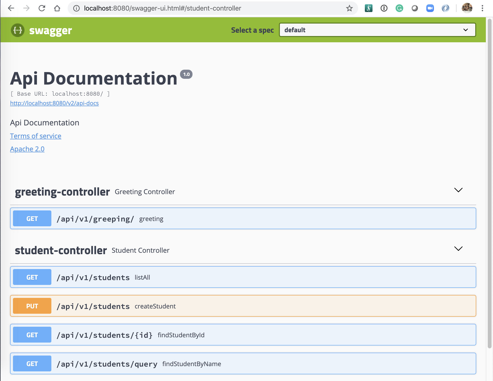
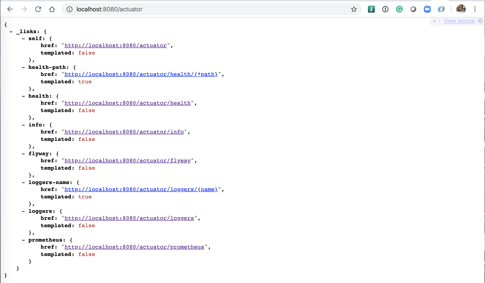
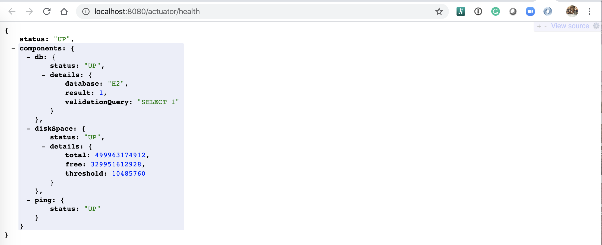
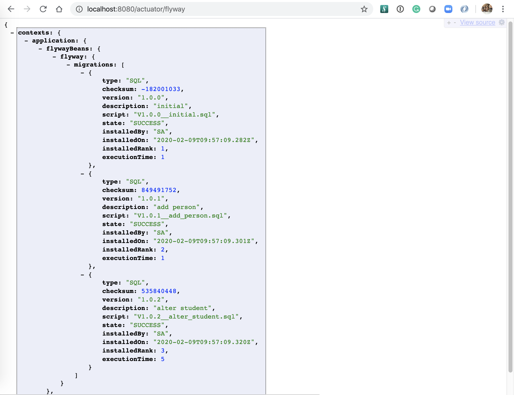
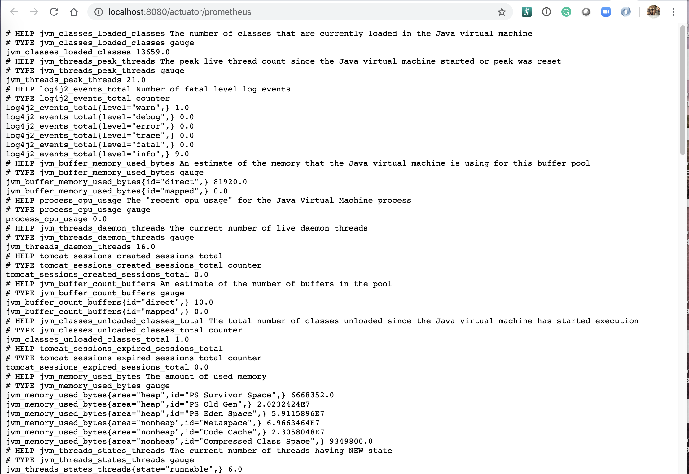
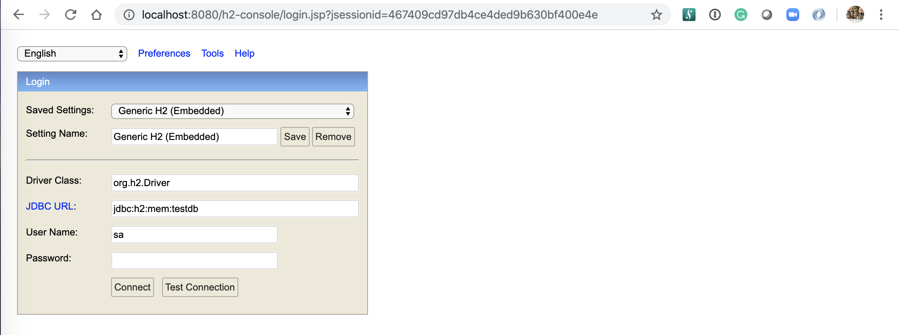
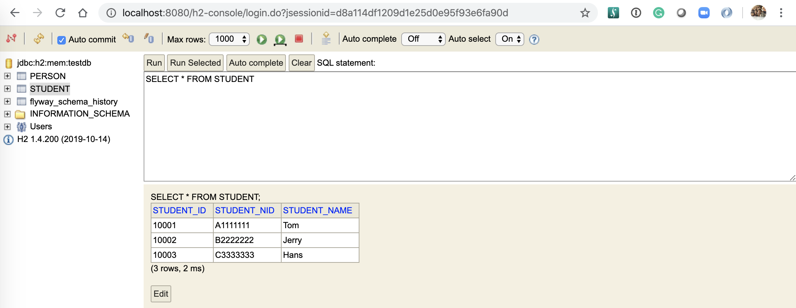
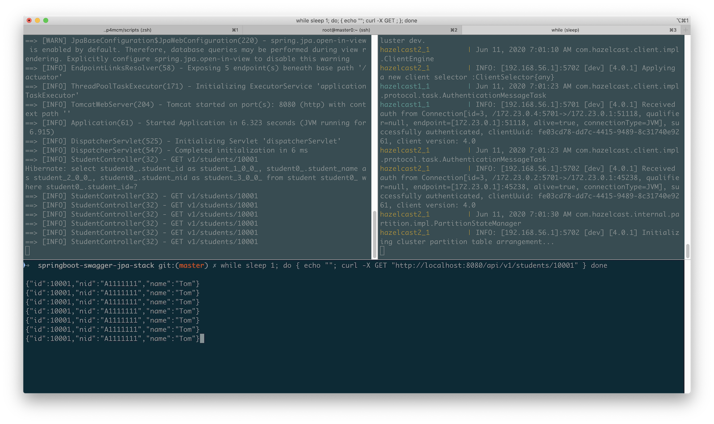
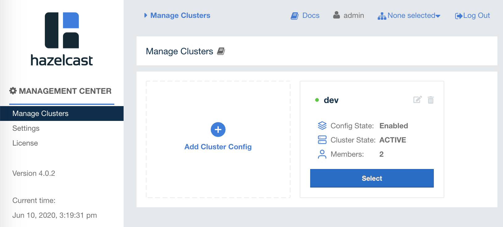

# springboot-swagger-jpa-stack

It's a common practice to start a Java project with some goals in mind.

If you want to build RESTful APIs with DB as the backend, you may think of:

- Using [Spring Boot](http://projects.spring.io/spring-boot/) because it brings in great productivity and simplifies Java development;
- Using [Swagger](https://github.com/swagger-api/swagger-ui) so make exposing and documenting RESTful APIs fun;
- Using JPA because it's standard and makes talking to RDBMS easy;
- Using [H2](https://www.h2database.com) as an embedded database for local development and testing;
- Using [Flyway](https://flywaydb.org/) to make database upgrades / patches as code;
- Using [micrometer](http://micrometer.io/) to expose Prometheus-style metrics;
- Using Spring Boot Test Framework with Junit, [Rest Assured](https://github.com/rest-assured/rest-assured) for testing;
- Optionaly, using [Hazelcast](https://hazelcast.org/) as the cache engine for some use cases, e.g. Hibernate second-level cache;
- etc.

But make all these frameworks fully integrated may take some effort.

So the aim of this sample Java project is to integrate them with some practices and sample code for you to start with.

There is also a bonus: a workable `Dockerfile` which supports multi-stage!

The major components include:

- **Spring Boot v2.5.x**
  - org.springframework.boot:spring-boot-starter-web
  - org.springframework.boot:spring-boot-starter-data-jpa
  - org.springframework.boot:spring-boot-starter-log4j2
  - org.springframework.boot:spring-boot-starter-actuator
- **Swagger v3.0.x**
  - io.springfox:springfox-boot-starter
- **Flyway v6.0.x**
  - org.flywaydb:flyway-core
- **H2 v1.4.x**
  - com.h2database:h2
- **Prometheus support with micrometer**
  - io.micrometer:micrometer-registry-prometheus
- **Hazelcast client v4**
  - com.hazelcast:hazelcast-spring
- **Testing**
  - org.springframework.boot:spring-boot-starter-test
  - junit:junit
  - io.rest-assured:rest-assured


## File structure

The project follows a series of conventions / best practices of Maven, Spring Boot and Flyway.

## Get started

Make sure you have Maven 3.x and JDK 1.8+ installed.

```
$ java -version
openjdk version "1.8.0_242"
OpenJDK Runtime Environment (AdoptOpenJDK)(build 1.8.0_242-b08)
OpenJDK 64-Bit Server VM (AdoptOpenJDK)(build 25.242-b08, mixed mode)

$ mvn -version
Apache Maven 3.6.2 ...
```

### Start up the app

Let's get started:

```
$ mvn clean spring-boot:run
```

> Note: 
> 1. Without specifying any profile, it will automatically fall back to `default` profile so `application.yml` and `application-default.yml` will be loaded, where `H2` embedded in-memory will be used;
> 2. The app serves at port `8080`, as usual, but we can use another port, say `8090` by explictly setting `server.port`, like `-Dspring-boot.run.jvmArguments="-Dserver.port=8090"`

### Access Swagger UI

Open a browser and navigate to: http://localhost:8080/

```sh
$ open http://localhost:8080/
```



> Note: 
> 1. Note the `/` URI will be automatically redirected to Swagger UI: in v2.x it's at `/swagger-ui.html`; while in v3.x, it's at `/swagger-ui/index.html`;
> 2. All the APIs exposed can be tried through the UI, do try it out!


### See what Actuator offers

A list out-of-the-box Actuator services have been exposed, in `dev` profile.



The `health` with DB info: http://localhost:8080/actuator/health



The `Flyway` info: http://localhost:8080/actuator/flyway



The Prometheus metrics: http://localhost:8080/actuator/prometheus




### Access H2 console

Open a browser and navigate to: http://localhost:8080/h2-console



Make sure:
- **JDBC URL**: `jdbc:h2:mem:testdb`
- **User Name**: `sa`
- **Password** is empty.

Click the Connect button and we can play with the database.




## Run it with specified Spring Profile(s)

Somehow, the Spring Boot profiles evolve to something quite difficult to understand.

When no profile is specified while running by `mvn clean spring-boot:run`, it fallbacks to a so-called "default" profile in `application.yml` or `application-default.yml`.
In our case, as we specify the "default" group in `application.yaml`, it will eventually load two profiles: `default` and `h2`.

There is a flexible way to combine some of the profiles.

For example, if you want to connect to **production**-like external DB, e.g. `MySQL`, without changing the code, do two things:

Firstly, let's log into the MySQL and create the database, user with proper permissions:

```sh
$ mysql -u root -p  # or sudo mysql in v8

mysql> CREATE USER 'myuser'@'%' IDENTIFIED BY 'mypassword';
mysql> CREATE DATABASE testdb;
mysql> GRANT ALL PRIVILEGES ON testdb.* TO 'myuser'@'%'; # note, we may grant more granular permissions here
mysql> FLUSH PRIVILEGES;
```

And then we can activate the right Spring profile(s), say `prod,mysql`, with necessary env variables specified:

```sh
# Change the values that make sense to your env
$ SPRING_DATASOURCE_URL="jdbc:mysql://<DB HOST>:3306/testdb" \
  SPRING_DATASOURCE_USER="myuser" \
  SPRING_DATASOURCE_PASSWORD="mypassword" \
  SPRING_PROFILES_ACTIVE=prod,mysql \
  mvn clean spring-boot:run
```

As a result, `application-prod.yml` and `application-h2.yml` will be loaded to make it a combined setup.


## Run it with Hazelcast integrated

### Start up Hazelcast cluster

Let's start a Hazelcast cluster by using `docker-compose`.

```sh
IP_ADDR="192.168.56.1"      # CHANGE ME TO YOUR MACHINE'S IP ADDRESS, e.g. 192.168.56.1
sed "s/192.168.56.1/$IP_ADDR/g" docker-compose/hazelcast.yml > docker-compose/_hazelcast.yml
docker-compose -f docker-compose/_hazelcast.yml up
```

> Note: as per my testing, using `localhost` or `127.0.0.1` won't work properly, so make sure use a right IP.

> OUTPUT:

```
...
management-center_1  | Hazelcast Management Center successfully started at http://localhost:8080/
management-center_1  |
hazelcast1_1         | Jun 10, 2020 9:20:06 AM com.hazelcast.internal.cluster.ClusterService
hazelcast1_1         | INFO: [192.168.56.1]:5701 [dev] [4.0.1]
hazelcast1_1         |
hazelcast1_1         | Members {size:2, ver:2} [
hazelcast1_1         | 	Member [192.168.56.1]:5701 - ccd75619-d3c9-4612-a95d-0aa51dd6770b this
hazelcast1_1         | 	Member [192.168.56.1]:5702 - f2603d08-a963-479c-b9d7-8b5cb7e6d2a0
hazelcast1_1         | ]
...
```

So two Hazelcast instances are up and lisening on: `192.168.56.1:5701` and `192.168.56.1:5702`.

### Start up the app with extra `hazelcast` profile

Open another console, run the app with one extra profile named `hazelcast`:

```sh
SPRING_PROFILES_ACTIVE=default,hazelcast mvn clean spring-boot:run
```

The functionalities are exactly the same but the `/api/v1/students/{id}` requests with the same id will be cached after the first request.

Open the third console and let's test it out by simply using `curl`:

```sh
while sleep 1; do { echo ""; curl -X GET "http://localhost:8080/api/v1/students/10001" } done
```

> OUTPUT: you will see only first request will hit database

```
==> [INFO] StudentController(32) - GET v1/students/10001
Hibernate: select student0_.student_id as student_1_0_0_, student0_.student_name as student_2_0_0_, student0_.student_nid as student_3_0_0_ from student student0_ where student0_.student_id=?
==> [INFO] StudentController(32) - GET v1/students/10001
==> [INFO] StudentController(32) - GET v1/students/10001
...
```



You may try out some other caching scenarios too to see how Hazelcast is integrated with JPA + Hibernate.

For example:

```sh
# POST to create a new record
curl -i -X POST "http://localhost:8080/api/v1/students" -H "Content-Type: application/json" --data '{"id":20001,"nid":"test","name":"test"}'
# GET it back, without hitting the database directly!
curl -i -X GET "http://localhost:8080/api/v1/students/20001"
# PUT to update this record
curl -i -X PUT "http://localhost:8080/api/v1/students" -H "Content-Type: application/json" --data '{"id":20001,"nid":"test2","name":"test2"}'
# GET it back, again, without hitting the database directly!
curl -X GET "http://localhost:8080/api/v1/students/20001"
```

### Manage Hazelcast in its management console

In browser, navigate to Hazelcast's management console by: http://localhost:8090.

You then can create an account, for example:
- Security Provider: `Default`
- Username: `admin`
- Password: `Password1`

Then you can use this user to log into Hazelcast's management center.

In "Manage Clusters" , click "Add Cluster Config" button to add cluster, for example:
- Cluster Name: `dev`
- Cluster Config State: `Enabled`
- Member Addresses: e.g. `192.168.56.1:5701` `192.168.56.1:5702`



> Note: 
> 1. Again, make sure to use your machine's right IP address instead of `localhost:5701` or `127.0.0.1:5701`, otherwise the newly created cluster would be in "Disconnected" state;
> 2. Use `tab` key after keying in the the member address and you can add more member addresses.

After that, you can visualize Hazelcast on the management console.


## Containerize It

A `Dockerfile` is provided for you to containerize the app with multi-stage build in mind.

```sh
# Define how to tag your image
$ export IMAGE_NAMESPACE=<YOUR REGISTRY WITH NAMESPACE, e.g. docker.io/brightzheng100>

# For X84_64 or amd64, use "latest" for simplicity purposes
$ export IMAGE_TAG=latest
# For arm64, use a dedicated tag "arm64"
$ export IMAGE_TAG=arm64

# Build it
$ docker build -t ${IMAGE_NAMESPACE}/springboot-swagger-jpa-stack:${IMAGE_TAG} .

# Optionally, push it to the Docker Registry
$ docker push ${IMAGE_NAMESPACE}/springboot-swagger-jpa-stack:${IMAGE_TAG}
```

There are a couple of build args provided, with defaults:

| ARG | Default | Purposes  |
| --- | --- | --- |
| ARTIFACT_TITLE  | "springboot-swagger-jpa-stack" | To tag the Docker image title: `LABEL org.opencontainers.image.title="${ARTIFACT_TITLE}"` |
| ARTIFACT_VERSION  | "1.0.0-SNAPSHOT" | To tag the Docker image version: `LABEL org.opencontainers.image.version="${ARTIFACT_VERSION}"` |

For example, if we want to build the Image tagged as:
- org.opencontainers.image.title=my-app
- org.opencontainers.image.version=1.0.0

```
$ docker build \
  --build-arg ARTIFACT_TITLE="my-app" \
  --build-arg ARTIFACT_VERSION="1.0.0" \
  -t ${IMAGE_NAMESPACE}/springboot-swagger-jpa-stack:${IMAGE_TAG} .
```

Meanwhile, there are also env variables for run time:

| ENV | Default | Purposes  |
| --- | --- | --- |
| JVM_ARGS  | "" | To tune the JVM args if there is a need |

Please note that we can always inject the Spring-powered environment variables as well to influence some desired behaviours.

So to run it with Docker's ENV `JVM_ARGS` and Spring variables `SPRING_PROFILES_ACTIVE`, `SPRING_DATASOURCE_URL`, we can do this:

```
$ docker run \
  -e "JVM_ARGS=-Xms2G -Xmx2G" \
  -e "SPRING_PROFILES_ACTIVE=prod,mysql" \
  -e 'SPRING_DATASOURCE_URL=jdbc:mysql://192.168.1.148:3306/testdb' \
  -p "8080:8080" \
  ${IMAGE_NAMESPACE}/springboot-swagger-jpa-stack:${IMAGE_TAG}
...
==> [INFO] Application(655) - The following profiles are active: prod,mysql
...
==> [INFO] TomcatWebServer(204) - Tomcat started on port(s): 8080 (http) with context path ''
...
```

> Note: 
> 1. The MySQL IP of `192.168.1.148` is my laptop's IP, change it accordingly to yours;
> 2. You may inject more Spring variables, if there is a need, to override the default values;


## Deploy it to Kubernetes / OpenShift

```sh
# Define where to look up for your Docker image, or you can simply use mine
$ export IMAGE_NAMESPACE=docker.io/brightzheng100
# The database URL, which in our case is also within K8s/OCP, but it can be external too
$ export DATASOURCE_URL=jdbc:mysql://mysql:3306/testdb
# Export the right images for the right CPU arch
# For x86_64 or amd64
$ export IMAGE_MYSQL=mysql:5.7 && export IMAGE_APP=springboot-swagger-jpa-stack:latest
# For ARM64
$ export IMAGE_MYSQL=arm64v8/mysql && export IMAGE_APP=springboot-swagger-jpa-stack:arm64

# Deploy it to your desired namespace, say demo here, with a MySQL db
$ kubectl create namespace demo
$ kubectl apply -f kubernetes/secret.yaml -n demo
$ envsubst < kubernetes/mysql.yaml | kubectl apply -f - -n demo
$ envsubst < kubernetes/app.yaml | kubectl apply -f - -n demo
```

I've provided a simple `load-gen` tool too which will keep accessing some RESTful APIs:

```sh
$ kubectl apply -f kubernetes/load-gen.yaml -n demo
```

## OpenTelemetry Experiments

Please refer to [OpenTelemetry Experiments](./README-OTEL.md).


## References

- Spring Boot with Docker: https://spring.io/guides/gs/spring-boot-docker/
- Spring Data JPA Doc: https://docs.spring.io/spring-data/jpa/docs/2.2.4.RELEASE/reference/html/#jpa.query-methods.query-creation
- Some Dockerfile experience: https://github.com/appsody/stacks/tree/master/incubator/java-spring-boot2
